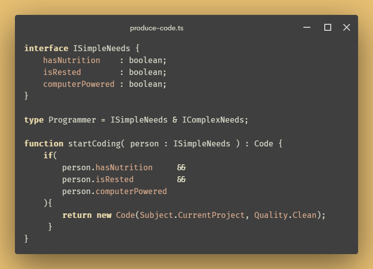

	
        
    
	
        <h3 style="margin: 0px; font-size: 2em; text-shadow: 1px 2px 0px #D61556;" align="center"><strong>Zachary A. K.</strong></h3>
        <h4 style="margin-top: 0px; margin-bottom: 30px;">If the wind will not serve, take to the oars.</h4>
    

 

\- 🔨 I’m currently working on **<a href="https://github.com/Dajeki/dajeki-tarot-server" style="color: #B31F59; text-decoration: none; box-shadow: inset 0 -20px 0px -7px #E8C073; padding:0px 5px">Dajeki-Tarot</a>**

\- 🌱 I’m currently learning React and Heroku deployment

\- 🤝🏻 I’m looking to find an open source project I can comfortably commit on!

 

<table style="border: solid 2px black;">
	<thead style="background-color: #4E0138; color: #E8C073;">
        <tr>
            <th style="text-align: center; width:25%;" valign="top" >Languages</th>
            <th style="text-align: center;" valign="top" width="25%">Frontend</th>
            <th style="text-align: center;" valign="top" width="25%">Backend</th>
            <th style="text-align: center;" valign="top" width="25%">DevOps</th>
        </tr>
	</thead>
    <tbody>
        <tr>
            <td style="border: solid 2px black; background-color: #EEEEEE;">                     
                          
                                         
                        
                          
                          
                          
                          
                           
		</td>
            <td style="border: solid 2px black; background-color: #EEEEEE;">                
					  
                      
                      
                    
			</td>
			<td style="border: solid 2px black; background-color: #EEEEEE;">                     
                                                  
                    	  
                    	  
                          
                    	
			</td>
            <td style="border: solid 2px black; background-color: #EEEEEE;">                   
                     
                     
                           
                           
            </td>
        </tr>
    </tbody>
</table>
 

	

 
<h3 align="center">Communication Lines 🔌</h3>

    
    
    

